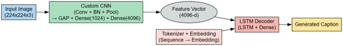
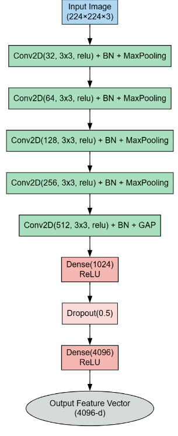
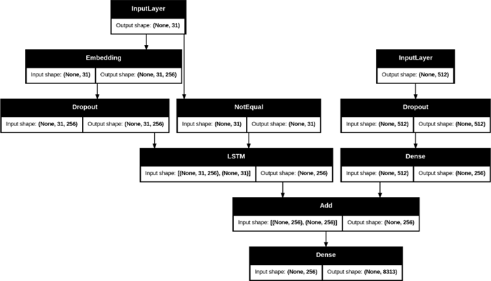
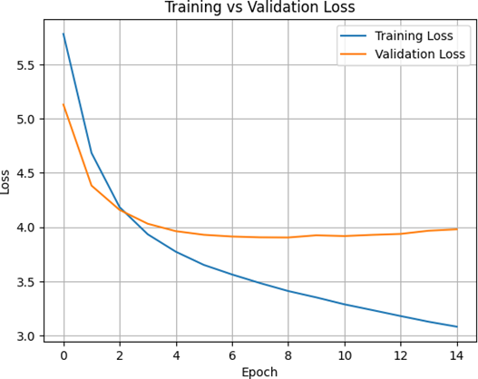
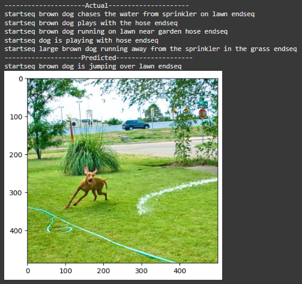
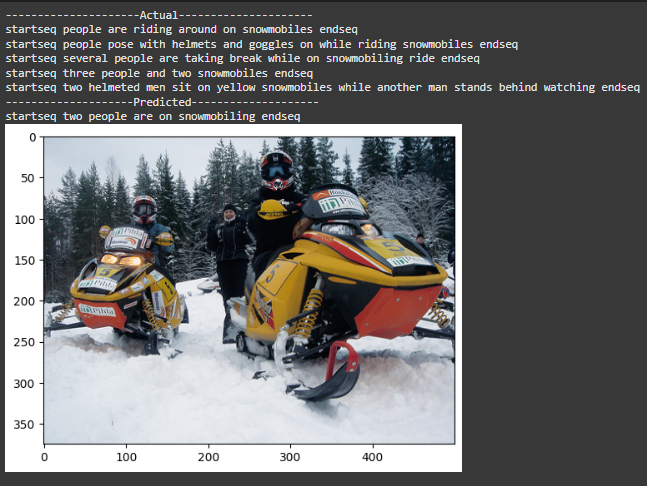

<<<<<<< HEAD
# 🖼️ Image Caption Generator using CNN-LSTM

This is a Deep Learning mini-project for **EC9170 - Deep Learning for Electrical & Computer Engineers**, University of Jaffna (April 2025). The project implements an end-to-end image captioning system using a custom-built CNN for feature extraction and an LSTM-based decoder for sequence generation.

## 👨‍🎓 Submitted By

* Nathiskar Shriganeshan (2021/E/190)
* Jenarththan Akilan (2021/E/006)

---

## 🎯 Objective

To build an image caption generator from scratch using:

* A custom CNN (no pretrained models)
* An LSTM decoder for caption generation
* Manual hyperparameter tuning
* BLEU score evaluation

---

## 🧠 Model Architecture

### 🔷 High-Level Model Flow



### 🟩 Custom CNN Encoder

* 5 Convolutional blocks with BatchNorm + MaxPooling
* Global Average Pooling
* Dense(1024) + Dropout(0.5) + Dense(4096)



### 🟥 LSTM Decoder

* Embedding → Dropout → LSTM
* Feature vector projected to match LSTM shape
* Add → Dense → Softmax



---

## ⚙️ Training Configuration

* **Loss Function:** Categorical Cross-Entropy
* **Optimizer:** Adam (lr=0.001)
* **Epochs:** 15
* **Batch Size:** 64

### 📊 Training vs Validation Loss



---

## 📊 Evaluation Metrics

* **BLEU-1:** 0.5787
* **BLEU-2:** 0.3520
* **BLEU-3:** 0.1896
* **BLEU-4:** 0.0921

---

## 🖼️ Sample Results

### ✅ Example 1 – Lawn Scene

**Actual Captions**

```
startseq brown dog chases the water from sprinkler on lawn endseq  
startseq brown dog plays with the hose endseq  
startseq brown dog running on lawn near garden hose endseq  
startseq dog is playing with hose endseq  
startseq large brown dog running away from the sprinkler in the grass endseq  
```

**Predicted Caption**

```
startseq brown dog is jumping over lawn endseq
```



---

### ✅ Example 2 – Snowmobile Scene

**Actual Captions**

```
startseq people are riding around on snowmobiles endseq  
startseq people pose with helmets and goggles on while riding snowmobiles endseq  
startseq several people are taking break while on snowmobiling ride endseq  
startseq three people and two snowmobiles endseq  
startseq two helmeted men sit on yellow snowmobiles while another man stands behind watching endseq  
```

**Predicted Caption**

```
startseq two people are on snowmobiling endseq
```



---

## 🧪 Cross-Validation

* **5-Fold Cross Validation**
* **Average Validation Loss:** 5.8250

---

## 💡 Limitations & Future Work

### 🔻 Limitations:

* No attention mechanism
* Slight overfitting after 10 epochs
* Lower BLEU-4 (fluency issue)

### 🔺 Suggestions:

* Add attention mechanism
* Try Transformer-based decoder
* Use pre-trained CNN (e.g., ResNet50)
* Expand dataset + data augmentation

---

## 📁 Repository Structure

```
ImageCaptionGenerator_CNN_LSTM/
│
├── notebook/                    # Jupyter Notebook
│   └── ImageCaptionGenerator.ipynb
├── images/                      # Plots and architecture images
├── utils/                       # Preprocessing or helper scripts
├── report.pdf                   # Final project report
├── requirements.txt             # Python dependencies
├── README.md                    # This file
└── .gitignore
```

---

## 📚 References

* [Kaggle](https://www.kaggle.com/)
* [GeeksForGeeks](https://www.geeksforgeeks.org/)
* [YouTube Tutorial](https://youtu.be/3H1x8SDYgvQ?si=1ERw_4PIOV-8UY3c)
=======
# ImageCaptionGenerator_CNN_LSTM
Deep Learning mini-project using custom CNN and LSTM to generate image captions.
>>>>>>> 57a55407e7bef26e65b1ad719a6a3e0420ddd5b6
